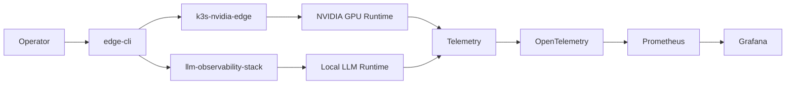

<div align="center">

# Mohammad Waqas

### AI Systems Engineer · GPU/LLM Inference · CUDA · Distributed Systems

**Building reproducible LLM inference systems for constrained NVIDIA GPU environments.**

[](https://github.com/waqasm86)
[](https://www.linkedin.com/in/mohammad-waqas-3a1384270/)
[](https://waqasm86.github.io/)
[](https://www.kaggle.com/waqasm86)
</div>

---

I have built **GPU-accelerated LLM inference infrastructure**, with a particular interest in making modern AI runtimes work reliably on hardware and environments with real constraints.

My work spans:

* **vLLM and PyTorch inference**
* **CUDA runtime compatibility**
* **NCCL and multi-GPU execution**
* **llama.cpp / GGUF inference**
* **GPU and LLM observability**
* **Kubernetes / k3s GPU infrastructure**
* **C++/CUDA distributed systems**
* **OpenTelemetry, Prometheus and Grafana**
* **reproducible benchmarking and runtime diagnostics**

A recurring theme across my projects is simple:

> **Can we make sophisticated LLM infrastructure work predictably on the GPU hardware developers actually have?**

---

## What I'm Building Now

### 1. ⚡ kaggle-vllm

**Run upstream vLLM reproducibly on Kaggle's dual NVIDIA Tesla T4 GPUs.**

[](https://github.com/kaggle-vllm/kaggle-vllm)
[](https://github.com/kaggle-vllm/kaggle-vllm)


`kaggle-vllm` is a lightweight **compatibility and runtime-delivery toolkit** for running upstream vLLM inside Kaggle notebooks without replacing Kaggle's preinstalled CUDA/PyTorch stack.

It tackles a practical problem: vLLM is built primarily for modern production GPU environments, while Kaggle provides a tightly controlled notebook environment with its own Python, PyTorch, CUDA, NCCL and storage constraints.

The project validates and organizes that environment instead of pretending those constraints do not exist.

**Current capabilities include:**

* validated upstream vLLM runtime delivery;
* **2 × NVIDIA Tesla T4 / SM75** execution;
* CPython/PyTorch/CUDA compatibility checking;
* checksum-verified native runtime artifacts;
* safe `pip --target` runtime staging;
* NCCL two-rank execution;
* vLLM **tensor parallelism with TP=2**;
* single- and dual-GPU inference benchmarks;
* Qwen2.5-3B FP16 `sharded_state` save/reload;
* OpenAI-compatible vLLM serving;
* GPU topology and runtime diagnostics;
* reproducible evidence and benchmark artifacts.

```text
Kaggle Notebook
     │
     ├── Python / PyTorch / CUDA compatibility
     │
     ▼
kaggle-vllm SDK
     │
     ├── validated native vLLM runtime
     ├── environment diagnostics
     ├── runtime staging
     ├── benchmark tooling
     │
     ▼
Upstream vLLM
     │
     ├── GPU 0 ──┐
     │            ├── NCCL / TP=2
     └── GPU 1 ──┘
          │
          ▼
     LLM inference
          │
          ├── sharded checkpoints
          └── OpenAI-compatible API
```

**Why it matters:** inexpensive notebook GPUs can become useful environments for learning about real inference-runtime behavior—including CUDA compatibility, distributed execution, checkpoint loading and multi-GPU communication—rather than only high-level model APIs.

➡️ **[Explore kaggle-vllm](https://github.com/kaggle-vllm/kaggle-vllm)**

---

### 2. 🌐 Edge Computing LLM

**Private local LLM inference + Kubernetes-native GPU operations + observability.**

[](https://github.com/Edge-Computing-LLM)


**Edge Computing LLM** explores how the infrastructure patterns normally associated with cloud LLM deployments can be brought to constrained Linux systems and small NVIDIA GPUs.

The project separates the platform into explicit layers instead of building one large application.



#### Core repositories

| Project                                                                                       | Responsibility                                                                    |
| --------------------------------------------------------------------------------------------- | --------------------------------------------------------------------------------- |
| 🧭 [`edge-cli`](https://github.com/Edge-Computing-LLM/edge-cli)                               | Go control plane for install, validation, status, logs and safe operations        |
| ⚙️ [`k3s-nvidia-edge`](https://github.com/Edge-Computing-LLM/k3s-nvidia-edge)                 | k3s, containerd, NVIDIA runtime, GPU Operator and device-plugin infrastructure    |
| 📈 [`llm-observability-stack`](https://github.com/Edge-Computing-LLM/llm-observability-stack) | Local inference, OpenTelemetry, Prometheus, Grafana, dashboards and Helm profiles |
| 🔎 [`gguf-observability`](https://github.com/Edge-Computing-LLM/gguf-observability)           | Runtime and model-contract verification for GGUF workloads                        |
| 🧪 [`edge-llm-tests`](https://github.com/Edge-Computing-LLM/edge-llm-tests)                   | Cross-project infrastructure and reproducibility validation                       |

The reference environment deliberately includes **low-VRAM NVIDIA hardware**, CPU fallback, local models and single-node k3s.

This is not an attempt to imitate an unlimited cloud cluster.

It is an exploration of how much of the modern LLMOps stack can remain useful when compute, VRAM and infrastructure are limited.

➡️ **[Explore Edge Computing LLM](https://github.com/Edge-Computing-LLM)**

---

### 3. 📡 llamatelemetry

**CUDA-first Python SDK for GGUF inference and LLM observability.**

[](https://github.com/llamatelemetry/llamatelemetry)


`llamatelemetry` grew out of a practical problem I encountered while using `llama.cpp` tooling for CUDA LLM experiments:

**inference worked, but organizing models, runtime state, GPU metrics, server processes and benchmark evidence quickly became messy.**

The project turns that workflow into a Python SDK.

```text
Python application
       │
       ▼
llamatelemetry
       │
       ├── InferenceEngine
       ├── ServerManager
       ├── Model Registry
       ├── GGUF metadata
       └── Telemetry
               │
       ┌───────┴────────┐
       ▼                ▼
   llama.cpp         NVML / OTEL
       │                │
       ▼                ▼
 CUDA inference      GPU metrics
       │                │
       └───────┬────────┘
               ▼
        Observable LLM run
```

It includes:

* high-level GGUF inference;
* `llama-server` lifecycle management;
* OpenAI-compatible client access;
* model registry and metadata parsing;
* quantization helpers;
* GPU metrics collection;
* OpenTelemetry instrumentation;
* Kaggle dual-T4 presets;
* CUDA/C++ components;
* notebook-based reproducible workflows.

➡️ **[Repository](https://github.com/llamatelemetry/llamatelemetry)** · **[Documentation](https://llamatelemetry.github.io/)**

---

## Selected Systems Work

Beyond the three main projects, I use smaller repositories to explore individual pieces of the LLM infrastructure stack.

| Project                                                                                            | Area                       | What I explored                                                                              |
| -------------------------------------------------------------------------------------------------- | -------------------------- | -------------------------------------------------------------------------------------------- |
| [`CommGuard`](https://github.com/waqasm86/CommGuard)                                               | GPU communication research | Content-agnostic dual-T4 telemetry, NCCL calibration and workload-classification experiments |
| [`cuda-nvidia-systems-engg`](https://github.com/waqasm86/cuda-nvidia-systems-engg)                 | Distributed inference      | C++20/CUDA inference infrastructure combining TCP, MPI scheduling, storage and benchmarking  |
| [`cuda-mpi-llama-scheduler`](https://github.com/waqasm86/cuda-mpi-llama-scheduler)                 | Scheduling                 | Multi-rank llama.cpp/GGUF inference scheduling and latency/throughput measurement            |
| [`cuda-llm-storage-pipeline`](https://github.com/waqasm86/cuda-llm-storage-pipeline)               | LLM storage                | Content-addressed model artifacts, SeaweedFS and inference-run storage pipelines             |
| [`llcuda`](https://github.com/waqasm86/llcuda)                                                     | Kaggle CUDA                | CUDA-first experimentation with GGUF/llama.cpp on Kaggle dual T4                             |
| [`Ubuntu-Cuda-Llama.cpp-Executable`](https://github.com/waqasm86/Ubuntu-Cuda-Llama.cpp-Executable) | Runtime distribution       | Pre-built CUDA-enabled llama.cpp runtime delivery                                            |
| [`cuda-openmpi`](https://github.com/waqasm86/cuda-openmpi)                                         | GPU communication          | CUDA-aware MPI experimentation                                                               |
| [`local-llama-cuda`](https://github.com/waqasm86/local-llama-cuda)                                 | Local inference            | llama.cpp/CUDA experimentation on constrained NVIDIA hardware                                |
| [`cursor-llama-mcp-bridge`](https://github.com/waqasm86/cursor-llama-mcp-bridge)                   | Developer tooling          | Connecting local llama.cpp inference with MCP-based development workflows                    |
| [`Kaggle-Dropbox-HuggingFace`](https://github.com/waqasm86/Kaggle-Dropbox-HuggingFace)             | Artifact movement          | Moving model and experiment artifacts across constrained notebook/storage environments       |

---

## Engineering Focus

```text
                         LLM INFERENCE
                              │
          ┌───────────────────┼───────────────────┐
          │                   │                   │
          ▼                   ▼                   ▼
       PyTorch              GGUF              Serving
        vLLM              llama.cpp          OpenAI APIs
          │                   │                   │
          └───────────────┬───┴───────────────────┘
                          │
                          ▼
                    GPU RUNTIME
                          │
             CUDA · NCCL · NVML · MPI
                          │
                          ▼
                SYSTEMS INFRASTRUCTURE
                          │
             Linux · k3s · Kubernetes
                          │
                          ▼
                     OBSERVABILITY
                          │
        OpenTelemetry · Prometheus · Grafana
                          │
                          ▼
             REPRODUCIBLE EXPERIMENTS
```

I am particularly interested in the boundary between the **AI model** and the **system underneath it**:

* Why does an inference runtime fail on one CUDA environment and work on another?
* When does tensor parallelism actually help?
* What does NCCL communication cost on limited GPUs?
* How should model binaries and checkpoints be distributed reproducibly?
* What telemetry is necessary to understand an inference failure?
* How much production-style infrastructure can run on small or inexpensive hardware?
* How can experiments preserve enough evidence that somebody else can reproduce the result?

---

## Stack

### AI / LLM


### GPU / Systems


**CUDA · NCCL · NVML · MPI · CMake · Ninja · TCP/epoll**

### Infrastructure / Observability


**k3s · containerd · Helm · OpenTelemetry · Prometheus · Grafana**

---

## Current Direction

I am currently concentrating my open-source work around three layers:

**1. PyTorch LLM inference on constrained GPUs**
→ [`kaggle-vllm`](https://github.com/kaggle-vllm/kaggle-vllm)

**2. Local / edge LLM infrastructure**
→ [`Edge-Computing-LLM`](https://github.com/Edge-Computing-LLM)

**3. CUDA-first inference observability**
→ [`llamatelemetry`](https://github.com/llamatelemetry/llamatelemetry)

Together, these projects explore the same larger problem from different levels:

> **making GPU inference reproducible, understandable and useful outside large managed GPU clusters.**

---

## Connect

I am interested in collaborating on:

* LLM inference infrastructure
* vLLM
* CUDA and NVIDIA GPU systems
* inference performance engineering
* distributed inference
* GPU observability
* developer tooling for AI infrastructure
* constrained / edge GPU deployments

<p align="center">
  <a href="https://github.com/waqasm86">GitHub</a>
  ·
  <a href="https://www.linkedin.com/in/mohammad-waqas-3a1384270/">LinkedIn</a>
  ·
  <a href="https://llamatelemetry.github.io/">llamatelemetry docs</a>
</p>

---

<p align="center">
  <strong>Build for the hardware you have. Measure what actually happens.</strong>
</p>
